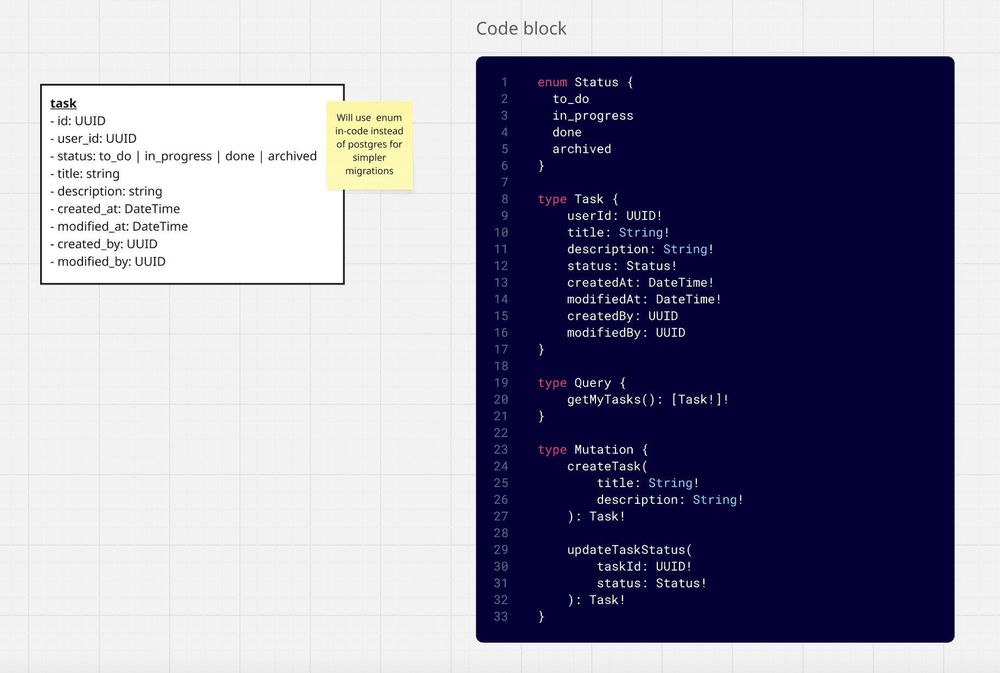

# Every.io Task App

## Getting Started
1. Run `make start` to run the application

  - You should see a note that the server is ready if things went well
2. Navigate [here](https://studio.apollographql.com/sandbox/explorer) to test the API.
3. Authentication is not fully built to use JWT - only a UUID user ID is required as part of the `Authentication` header. Ensure you're using the correct user ID when querying for and updating tasks.

## Architecture
I normally would make a diagram as detailed as possible for a new feature, outlining overall flows, GraphQL schema design, and database design (which I would put alongside the UX designs provided by product), so I did the same here. There wasn't a whole lot to add, but it still helped me approach the problem cleanly from the start.

Here is a screenshot of my Miro diagram:


## Testing
There is currently no automated testing for this app. Ideally, there would 
- a single test file for each query/mutation
- a single test file for the task data source

In lieu of automated testing, I did heavily test this via the Apollo Explorer.

Here is an example `createTask` mutation:
```
mutation {
  createTask(
    title: "Test Title", 
    description: "Test Description"
  ) {
    id
    userId
    status
    title 
    description
    createdAt
    modifiedAt
    createdBy
    modifiedBy
  }
}
```

Here is an example `updateTaskStatus` mutation:
```
mutation {
  updateTaskStatus(taskId: "valid-uuid", status: "in_progress") {
    id
    userId
    status
    title 
    description
    createdAt
    modifiedAt
    createdBy
    modifiedBy
  }
}
```

Here is an example `getMyTasks` mutation:
```
query {
  getMyTasks {
    id
    userId
    status
    title 
    description
    createdAt
    modifiedAt
    createdBy
    modifiedBy
  }
}
```

## Future Improvements
- The sync DB flag from TypeORM should always be off in production, and generated migration files should be used instead. Using sync DB in this case was done purely for speed/ease of use in local testing.
- Authorization is not real, but the overall flow demonstrates how I'd implement it. In a real system, JWT authorization is preferred. 
- There is currently no authentication implemented. In a real system, there should be an authentication decorator on the GQL schema that specifies which roles are allowed to call specific queries/mutations or access specific fields/data models.
- Logging! I would've loved to add this, but ran out of time. In the past I've used `winston` which I thought was great. A global logging instance is preferred, with the ability to inject additional details, such as user information, being injected at runtime. 
- Overall monitoring: Datadog is great, and any system like this should leverage APM/DBM at a minimum, in my opinion, to allow for easier debugging and trace breakdowns.
- Clean code: `prettier` and `eslint` should be used in tandem for clean code and readability.
- Auditing: I've added created/modified by columns so it is clear at the database clear who has made changes, but this can be taken a step further by breaking out the `status` into it's own model, to preserve change history. 